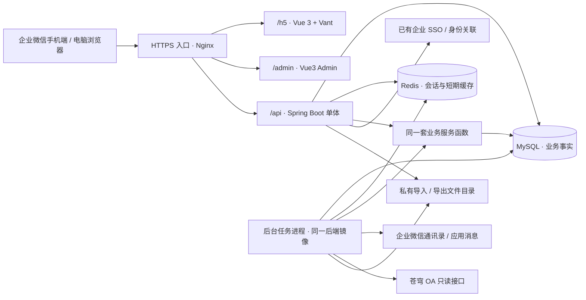

# 工时与项目成本管理系统 · MVP 技术架构

| 项目 | 内容 |
|---|---|
| 版本 / 日期 | v1.0 / 2026-09-05 |
| 产品依据 | [MVP 产品需求设计 v1.0](../prd/工时与项目成本管理系统_MVP产品需求设计_v1.md) |
| 业务依据 | [PRD v1.3](../prd/工时与项目成本管理系统_PRD_v1.md) |
| 定位 | MVP 开发架构基线，覆盖模块、数据、事务、权限、接口、任务与部署；不是已完成的代码或真实 OA 接口契约 |
| 当前基础 | 仓库目前只有需求文档；现有企微自建应用 SSO 与 UserID—工号关联可复用 |
| 已确认技术方向 | 企微 H5：Vue 3 + Vant；管理后台：Vue3 Admin；后端在用户允许的方案中选定 Spring Boot + WxJava；数据层：MySQL + Redis |

## 1. 架构决策

采用 **Vue 3 + Vant 企微 H5、Vue3 Admin 管理后台、Spring Boot + WxJava 单体后端、MySQL + Redis**。两端分别构建，共用一套业务 API、身份体系和业务规则。后台任务与 API 使用同一份后端代码和镜像，以不同运行模式启动。

本次选择 Spring Boot + WxJava 作为后端，不同时建设 NestJS 后端。现有企微 SSO 继续复用，WxJava 用于必要的企微服务端能力。相比产品文档第 2 节原设想的一套响应式前端，本轮用户已明确为双前端：手机 H5 承担填报、审批与本人查询，Admin 承担电脑端填报 / 审批、分析及管理。页面编号和业务口径保持一致。

这一规模约 100 人、每年约 7.5 万条工时，主要难点是历史数据、审批事实和权限一致性。使用关系数据库事务把这些规则放在一起实现，比拆分多个服务更适合首版。

### 1.1 技术栈与版本基线

| 层次 | 选型 | 用途与限制 |
|---|---|---|
| H5 | Vue 3、TypeScript、Vite、Vue Router、Vant 4 | 企微手机端 P01 / P02 和本人记录，移动表单与卡片 |
| Admin | Vue3 Admin 形态，Vue 3 + TypeScript + Vite，默认 Element Plus | 电脑端 P01–P11；具体模板仓库未指定，不假定已选择某个同名开源项目 |
| 后端 | Java 21、Spring Boot 4.1.x、Spring MVC、Spring Security | 一个 Maven 工程，REST API、验证、授权和业务服务；具体补丁在启动验证后锁定 |
| 企微 SDK | WxJava 的 `weixin-java-cp` 模块 | 通讯录、应用消息及确有需要的企微能力；不替代已存在的 SSO |
| 数据访问 / 迁移 | Spring JDBC / JdbcClient、MySQL Connector/J、Flyway | 显式 SQL、事务和版本化迁移；不同时叠加多个 ORM |
| 数据库 | MySQL 8.4 LTS，InnoDB | 唯一业务事实库，保存版本快照、审计、任务与通知记录 |
| Redis | 公司受维护的稳定版本 | Spring Session 会话、企微短期 token / ticket 缓存；不保存唯一业务事实 |
| Excel | Apache POI XSSF / SXSSF | 固定 XLSX 导入导出；不接入通用 BI 或报表平台 |
| Web 运行 | Spring Boot 内嵌容器 + Nginx | Nginx 提供两个前端静态资源及同域 API 反向代理 |
| 后台任务 | Spring 固定调度入口 + MySQL 持久任务 | 同步、提醒、自动提交、封账、导出；进程与 API 分开启动 |
| 部署 | Docker Compose，优先使用已有 Linux 虚拟机和受管 MySQL / Redis | 首版不引入 Kubernetes、微服务、额外消息中间件或 Elasticsearch |

Spring Boot 4.1 的官方 Java 支持范围包含 Java 21。WxJava 官方提供企业微信 CP 模块；优先直接配置这个 SDK 模块，避免默认套用与 Boot 版本未验证的第三方 starter。开工先验证 Boot、WxJava、数据库驱动、Flyway 及会话依赖的共同构建和启动，再锁定补丁，本文不声称已完成该联调。[Spring Boot 系统要求](https://docs.spring.io/spring-boot/system-requirements.html)、[WxJava 官方项目](https://github.com/binarywang/WxJava)

Vue 官方支持通过 Vite 建立 TypeScript 项目；构建流程另运行 `vue-tsc`，避免仅转译而未做类型检查。[Vue TypeScript 指南](https://vuejs.org/guide/typescript/overview)

Vant 用于移动 Web，Admin 使用桌面组件；两端共享 API 类型、状态枚举和业务错误处理，不强行共享 UI 组件。[Vant 官方项目](https://github.com/youzan/vant)、[Element Plus 安装说明](https://element-plus.org/en-US/guide/installation.html)

前端采用 `npm workspaces` 管理两端及共享接口包，提交 lockfile；后端使用 Maven Wrapper、Spring Boot BOM 和显式固定的其他依赖版本。Node.js 只用于前端开发与构建，具体版本按所选 Vite 要求锁定，不进入生产 API 进程。

### 1.2 首版明确保留的技术约束

1. 所有人员关联使用内部自增 ID；工号和企微 UserID 仅为外部标识。
2. 业务输入、更正版本、处理结论和已发布月报可追溯，不能只保留一份不断覆盖的数据。
3. 所有人工通过操作回避本人；管理员角色与业务审批权限分开。
4. 工时和现场日独立送审、独立计价；后台任务也执行相同规则。
5. 审批金额按发生日职级和费率固化；历史查询不能用当前标准重算。
6. 封账约束覆盖整个月份的新增、修改、补审及同步，不只是给已通过行增加一个状态。
7. 页面、接口、导出和月报版本使用同一套数据范围与字段权限。

## 2. 系统组成与代码边界



前端不直连 OA、企微接口或数据库。现有 SSO 只负责证明身份；系统内角色、项目权限、审批指派和历史版本访问由后端决定。

### 2.1 后端模块

模块是同一应用内的代码目录，不独立部署，不通过 HTTP 互相调用。

| 模块 | 职责 | 对应产品页面 |
|---|---|---|
| `identity` | SSO、人员、组织、生效历史、角色范围 | P07，以及全部页面的登录与权限 |
| `work` | 归集对象、工作日历、请假基数、日记录、工时与现场日版本 | P01、P08 |
| `approval` | 拆包、路由、通过 / 驳回、更正、转交、争议 | P02 |
| `costing` | 职级 / 现场标准、发生日计价、审批成本快照 | P09、审批金额 |
| `reporting` | 当前分析、版本查询、范围过滤、Excel | P03–P05 |
| `closing` | 月份写入控制、解锁事项、封账与修订发布 | P06 |
| `integrations` | 现有身份能力接入、OA 与企微客户端、导入、来源差异 | P10 |
| `operations` | 固定任务、通知、参数版本、审计、健康检查 | P11 |

Controller 负责输入验证和响应，Spring Security 负责认证入口；业务 Service 执行范围检查、状态变更及事务，具体查询类集中处理 SQL 范围与聚合。手工操作、Excel 导入和后台任务都调用业务服务，禁止各写一套状态更新逻辑。

### 2.2 建议目录

以下为待创建的代码结构，不表示仓库已有这些文件。只为实际功能添加文件，不预建通用 Repository、事件总线或接口工厂。

```text
backend/
  pom.xml / mvnw
  src/main/java/.../
    identity/ work/ approval/ costing/
    reporting/ closing/ integrations/ operations/
  src/main/resources/db/migration/
  src/test/
frontend/
  apps/h5/                 Vue 3 + Vant，手机业务
  apps/admin/              Vue3 Admin，电脑业务
  packages/api-client/     共享接口类型、请求和状态枚举
  package.json             npm workspace 与 lockfile
deploy/                    容器、反向代理、备份与运行说明
docs/prd/
docs/architecture/
```

按业务包放置 Controller、Service、具体查询 / 写入类和 DTO，避免每个 Service 都配一个仅有单实现的接口。Spring JDBC 已提供参数绑定和数据库异常转换，MVP 使用其现成能力，不自建 ORM。[Spring JDBC 文档](https://docs.spring.io/spring-framework/reference/data-access/jdbc/core.html)

Admin 也是业务前端，不是数据库管理工具；其审批、费率及封账页面调用相同后端服务，不能通过通用 CRUD 接口修改业务状态。

## 3. 数据设计

### 3.1 存储约定

| 类型 | 约定 |
|---|---|
| 主键 | 业务表默认 `bigint` 自增；人员必须使用稳定 `app_user.id`，API 中 bigint ID 以字符串传输 |
| 工号 | `employee_no varchar(20)`、唯一、按字符串接收与导出，保留前导零；校验五位数字或两位英文字母加五位数字 |
| 时长 | 存整数分钟，默认步长 30 分钟；API 输入小时字符串，由服务端精确换算；零工时不建立工作条目 |
| 金额 | MySQL `DECIMAL` 与 Java `BigDecimal`；金额到分，费率保留足够精度；API 返回十进制字符串 |
| 业务日期 | `date`，按 `Asia/Shanghai` 划日、自然周和核算月份 |
| 操作时间 | `DATETIME(6)` 按 UTC 保存，JDBC / 数据库连接时区统一 UTC，Java 使用 `Instant`；页面按公司时区显示 |
| 生效范围 | 起日包含、止日不包含，即 `[from, to)`；无终止日表示持续有效 |
| 删除 | 关联业务的人员 / 部门 / 对象停用；业务撤销保留版本及依据；不级联删除历史 |
| JSON | MySQL JSON 只用于冻结快照、审计前后值、来源资料和固定任务参数；核心关联、状态、金额与时长使用普通列 |

工号大小写遵循现有身份体系契约，不截取数字、不按姓名猜测，不把企微 UserID 自动改写为工号。表名使用 `app_user`；工号和 UserID 采用精确、区分大小写的排序规则，不直接继承中文搜索字段的宽松比较规则。所有表使用 InnoDB 与 utf8mb4，业务 ID 使用 `BIGINT AUTO_INCREMENT`。

### 3.2 身份、组织与标准

| 表 / 实体 | 关键内容与约束 |
|---|---|
| `app_user` | `id`、`employee_no`、唯一 `wecom_userid`、姓名、在职状态、当前部门 / 职级展示字段；外部身份变更不换主键 |
| `reporting_enrollment` | 人员适用填报的生效区间，覆盖试点纳入、正式启用及退出；用于应填人日分母，不能从今天的在职状态反推历史 |
| `department` | 稳定编码、名称、父部门、状态、指定部门负责人、分管领导；组织树禁止循环 |
| `user_department_history` | 人员、部门、生效范围；支持补填发生日归属，单个人员同一时点只有一个主部门 |
| `department_manager` | 部门、人员、部长 / 副部长展示类型、生效范围；允许多人同时担任，部长与副部长业务权限一致 |
| `role_grant` | 固定角色及公司 / 部门范围、生效与撤销记录；PM 范围主要由项目关系决定，不手工重复维护项目权限清单 |
| `user_level_history` | 人员、职级、生效范围，区间不重叠 |
| `work_item` | 稳定编码、类型、来源、当前主责部门、默认审批人、状态；跨部门非项目事项也必须对应对象 |
| `work_item_history` | 影响历史归属的主责部门等业务属性及生效范围；当前默认审批人用于新送审路由，实际审批结果另外留存 |
| `rate_card` / `onsite_rate` | 职级日标准 / 现场日标准、有效范围；同一计价维度不能存在交叠标准 |
| `rate_dimension` | 预置初 / 中 / 高职级及现场标准维度，每维度一行；用于并发新增标准时锁定稳定父记录 |

人员职级 / 部门历史变更先锁对应人员，项目历史变更锁项目，标准变更锁预置的 `rate_dimension`；随后在同一事务中检查 `[from,to)` 重叠并新增。不能仅做无锁的“先查再插入”，也不能锁一条尚不存在的费率行来防止并发穿透。普通 CHECK 只负责单行的起止日合法性，跨行不重叠由稳定父记录锁及事务服务保证。

初始导入明确覆盖试点开始日期。OA 只有当前属性而无法给出历史生效时间时，不推测过去的部门或负责人；由业务方确认初始有效范围。以后变动新增历史记录，已确认成本和已发布报告不跟随当前属性重算。

### 3.3 日记录、业务版本与审批

采用“稳定业务记录 + 内容版本”的模型。PRD 中的概念实体据此细化，业务含义不变。

| 表 / 实体 | 关键内容与约束 |
|---|---|
| `day_record` | 唯一 `(user_id, work_date)`；工作日历基数、请假扣减、有效基数、发生日部门、并发版本号；不保存成本总额 |
| `time_entry` | 稳定工时记录 ID、所属日记录、当前内容版本指针 |
| `time_entry_revision` | `entry_id`、版本号、申报 / 取消动作、对象、分钟、内容、发生日归属快照、状态、提交时间、成本快照及更正原因；唯一 `(entry_id, revision_no)` |
| `onsite_day` | 一个日记录最多一个现场日主体，保存当前版本指针；取消后仍保留主体供追溯 |
| `onsite_day_revision` | 版本号、现场项目、事由、申报 / 取消动作、状态、现场标准及金额快照；零工作投入也可申报 |
| `approval_package` | 唯一 `(user_id, week_start, work_item_id)`；默认路由依据、当前实际审批人、回避原因、周截止时点 |
| `approval_item` | 包、具体工时版本或现场日版本、送审轮次信息、待处理 / 通过 / 驳回结论、实际处理人、时间、原因；两个版本外键恰好一个非空 |
| `approval_transfer` | 转交包、原 / 新实际审批人、未处理项范围、业务指定依据、操作者、时间 |
| `dispute_case` | 争议条目、双方说明、协调 / 裁定人、结论、原因、时间；状态独立于业务审批状态 |

内容保存、更正或驳回后再提交产生新内容版本；旧版本保留。已送审版本的对象、分钟、内容和现场事由不可原地修改，状态只能通过业务服务变化。旧版本的审批结论、操作者及成本快照不覆盖。

当前分析只读取主体指向的当前版本；历史审计读取全部版本；正式月报读取报告快照。三种读法必须明确，避免把新旧版本同时累加。

当前版本指针必须指向本主体的版本，由外键 / 组合约束及同一事务保证。通过结果与成本写入后，后续锁定只改变锁定信息，不重新写金额。现场的“在司 / 现场”显示从当前现场申报派生，不再维护另一份可独立覆盖审批结果的地点状态。

工作记录取消、现场申报取消也记录新版本。已通过记录的取消需按更正送审；现场取消版本仍携带原项目以确定审批路由，通过后计天数为 0，不物理删除原申报。

### 3.4 月报、来源与运维

| 表 / 实体 | 关键内容与约束 |
|---|---|
| `accounting_period` | 每个核算月一行；预定封账时间、开放 / 封闭状态、实际封账时间、最新已发布版本；也是月份写入控制的数据库锁对象 |
| `amendment_batch` | 一个封账月的一次修订；原因、状态、申请 / 授权 / 完成记录；首版限制每月同时只有一个进行中的修订批次 |
| `unlock_scope` | 修订批次下的授权范围：人员、日期、对象、记录或允许新增范围、动作及授权人；不会开放整月 |
| `monthly_report_version` | 月份、版本号、唯一 `operation_key`、实际截点、生成 / 发布时间、前版、修订原因、口径版本；唯一 `(period_id, version_no)` |
| `monthly_snapshot_row` | 报告版本、行类型、人员 / 项目等范围索引、冻结的具体数据；保存工时、现场、日基数、缺填、未决及流程事实 |
| `source_record` | 系统、数据集、外部单据 / 明细键、来源版本、规范化数据、应用状态；记录变更和撤销，不只看最新名单 |
| `sync_run` / `import_batch` | 来源覆盖期间、增量游标、批次状态、有效 / 无效条数、文件及错误信息 |
| `integration_issue` | 身份、字典、项目来源冲突、封账差异；对应原始来源和处理依据 |
| `job` / `notification_outbox` | 固定任务及通知的持久化状态、去重键、重试时间、结果与错误；通知在业务事务内登记 |
| `command_receipt` | 关键写入的操作者、命令类型、去重键、请求摘要和结果引用；同键不同内容拒绝，重放仍验证当前权限 |
| `system_config_version` | 工作日历和业务 / 提醒参数的配置版本、生效时间、操作者 |
| `audit_event` | 业务事件、对象及版本、操作者、时间、原因、前后值、请求关联 ID；追加记录 |

审批包状态、日填报合计、项目总成本优先查询计算，不同时维护多份可独立写入的总数。封账快照可以保存冗余结果，因为它表达固定截点，不能当成另一套当前业务数据。

`accounting_period.active_amendment_id` 指向本月唯一正在处理的修订批次；创建 / 结束批次必须独占月份行后更新此指针。历史批次不覆盖，普通业务账号无绕过服务直接创建活跃批次的入口。

### 3.5 首批约束与索引

- 唯一约束：工号、UserID、人员日期、每人每日现场主体、版本序号、审批包业务键、每个版本的审批项、来源键、任务去重键及月报版本号。
- 检查约束：分钟非负 / 工时条目大于零、日标准非负、审批项外键二选一、生效日期顺序；跨行的日总量和角色回避在持锁业务服务中检查。
- 常用索引：日记录 `(user_id, work_date)`；审批包 `(approver_user_id, week_start)`；待处理审批项；版本中的项目与状态；快照 `(version_id, row_kind, project_id)` 及人员范围；任务 `(status, next_run_at)`。
- 部门负责人历史允许多人，因此不能错误增加“部门在同一日期只有一位负责人”的约束。
- 一张工时表连接一张现场表后直接求和会放大金额。报表先分别聚合两类成本，再按项目关联汇总。

## 4. 登录与权限

### 4.1 复用现有 SSO

1. 浏览器进入本系统；无有效会话则跳转已有 SSO。
2. 后端按现有协议验证票据或签名，核对目标应用、有效期、防重放及回跳状态；具体参数等信息部门契约。
3. 调用已打通的 UserID—工号关联取得身份，解析到同一 `app_user.id`。不信任浏览器自行提交的工号或 UserID。
4. 校验人员在职及本系统准入信息，通过 Spring Security 建立登录认证，Spring Session 将会话放入 Redis；角色及数据范围从 MySQL 读取。
5. 后续请求持续核对账号有效性，离职停用和授权撤销不等会话自然过期才生效。

H5、Admin、API 默认部署在同一域名的 `/h5`、`/admin`、`/api`，使用共享 HttpOnly、Secure 会话 Cookie，默认 SameSite=Lax；SSO 回跳方式按已有协议核对。修改请求保留 Spring Security 的 CSRF 校验，两端请求层提交 CSRF token，登录令牌不放 localStorage。会话复用 Spring Session 的 Redis 支持，不另建 JWT / Refresh Token 体系。[Spring Session Redis 配置](https://docs.spring.io/spring-session/reference/configuration/redis.html)

工号变更时使用已有身份能力和变更依据定位原人员；旧工号无法解析则记录接入异常。没有证据时不新建同名人员。生产环境不启用测试身份旁路，也不允许请求参数指定登录人。

### 4.2 两层授权

**第一层检查能否执行该动作，第二层限定可操作的行及可返回的字段。** Spring Security 检查登录与粗粒度动作权限，业务服务检查记录范围；管理员角色没有绕过本人回避的特权。

| 操作 | 必须使用的范围 |
|---|---|
| 我的记录 | 登录用户本人 |
| 待我审批 | 包内当前实际审批人 + 当前仍待处理项 + 非本人；最终处理人写入每个审批项 |
| 项目成本 | 当前本人负责项目 / 当前所辖主责项目 / 已授权全公司范围的并集 |
| 人员负荷 | 本人 / 当前所辖人员集合；其中金额再套用项目成本范围 |
| 指定审批或争议 | 仅对应包或争议依据，不转化为全项目报表权 |
| 解锁 | MVP 约定的主责项目 / 部门非项目 / 分管范围，管理员可全局；新增范围同样限定对象 |
| 标准维护 | 只有系统管理员；PM 与其他获授权管理角色只读 |

历史报表按当前访问授权过滤，但行内名称、部门、费率和金额取历史快照。项目接管后的访问范围与报告当时归属分别处理，不能为匹配当前组织而修改旧报告的部门字段。

列表查询先将授权范围写入 SQL 条件，详情再检查对象，DTO 输出移除未授权字段。导出、统计汇总、后台任务生成的用户专属文件均调用同一范围函数。仅在 Controller 上加角色注解不够；不得认为“有 PM 角色”就能读取任何项目 ID。

## 5. 工时、审批与更正的事务

### 5.1 每日写入

所有影响业务月份的写入先经过第 7 节的月份门禁，再锁定 `day_record`。前端附带读取时的 `row_version`；服务端发现旧版本返回 409 和当前版本，避免两个标签页互相覆盖。

任一当前条目、审批结果、现场状态或基数变化均增加日版本号。保存日表单只更新明确允许编辑的草稿项；没有出现在请求中的待审批 / 已确认条目不能被当成删除。

日级校验基于该日所有当前有效工时版本：实际工作 + 待分配达到应填基数、总量不超过所用配置版本的上限（默认 1440 分钟）、符合步长及内容要求。已通过和待审批条目也参与合计；修改 2h 驳回条目时不重新要求填写完整 8h。

草稿保存允许业务内容不完整，但不能接受越权对象、错误身份、无法解析的日期或越过月份授权。新日记录使用唯一约束创建后加锁，不能依赖锁一条尚不存在的记录来防重。

工作日历与请假形成每日基数；按填报适用区间和部门有效范围预生成或补齐日记录，包括未填报日期，避免缺填人员在报告中消失。请假只扣基数，非工作日和全天假无工作时无需建立零小时条目。

### 5.2 按周送审

1. 根据员工选择的自然周读取工时与现场日的当前未送审版本，取两者对象并集。
2. 按日校验工时；现场日独立校验。同日有效现场日不受工时不足阻断。
3. 计算对象默认审批人及本人回避链，校验有效身份和指定依据；某日待提交工时有路由异常时，该日待提交工时保留草稿并返回异常，现场日另行独立判断。
4. 使用唯一业务键取得审批包，创建对应版本的审批项，记录截止时间、配置版本与提交事件；变为待审批。
5. 同一事务登记需发送的通知。已存在审批项的版本不重复送审。

手工及自动提交调用同一服务。每个自然日的工时送审保持一致，允许其他完整日期成功；失败结果逐日返回。现场日使用独立处理单元。若某对象已有未处理包，沿用该包的实际接收人；永久默认人变更不偷偷重路由已有待办。包已全部处理后新增送审项时重新核对路由，已有结论仍以条目处理记录为准。

### 5.3 通过与驳回

一个审批包中的所选可处理项在一个短事务内完成，业务上不可处理项先列明。获得月份及日锁后，再锁包和所选审批项，重新检查实际接收人、本人回避、争议、当前版本及月份授权。

- 通过工时：按第 6 节找发生日标准，写成本快照，记录实际审批人及时间。
- 通过现场：独立按自然日标准写快照；不要求同项目有工时，不依赖当日其他项目是否同时通过。
- 驳回：必须保存原因，不写确认成本；员工后续生成新内容版本再送审。
- 整包操作：只处理显示并确认的待处理项。状态变化、缺标准或权限变化返回明确结果；不能用一个包状态代替逐项校验。
- 数据库错误：所选事务单元回滚，不出现“结论已通过但金额未写入”。不在数据库事务内调用 OA 或发送企微消息。

用 `TransactionTemplate` 或通过 Spring 代理调用的 `@Transactional` 包住状态、成本、审计和通知登记；批量逐日 / 逐单元处理优先显式事务，避免同类方法自调用导致注解未生效。业务异常统一转换并明确回滚策略，外部网络动作由后台任务在提交后执行。[Spring 事务注解说明](https://docs.spring.io/spring-framework/reference/data-access/transaction/declarative/annotations.html)

### 5.4 更正、转交与争议

更正获准后创建新版本并切换当前指针；旧版事实、原审批人和快照保留。新版本重新通过前不进入当前确认金额；已发布月报保持原值。更换对象按新对象送审，差异中同时反映原项目减少与新项目增加。

人员和发生日期不在记录主体上原地改写。错日期按“原记录取消 + 正确日期新增”关联到同一更正事项，两个月分别判断权限；避免旧版本被新的日记录关联改变含义。

转交锁定包及未处理项，校验新接收人不是填报人，保存业务指定依据及转交记录。已处理项继续显示自己的 `handled_by`，不能读包上更新后的实际审批人冒充历史处理人。转交不重置截止时间。

争议状态作为附属条件阻止相关项通过；协调 / 裁定记录不能直接改工时数字或成本。业务服务依据结论执行更正或交实际审批人处理；同包无争议项继续正常处理。

## 6. 计价与统计计算

### 6.1 唯一计价函数

项目人工成本使用以下固定算法，审批、审批前试算和验收调用同一函数。算法口径带版本号，报表记录使用的口径版本。

```text
发生日职级 = 该人员覆盖 work_date 的职级历史
发生日标准 = 该职级覆盖 work_date 的日费率版本
人工金额 = 日费率 × 本条分钟数 / 480，保留 2 位，RoundingMode.HALF_UP
现场金额 = 发生日现场日标准 × 本次确认天数，保留 2 位，RoundingMode.HALF_UP
项目总额 = 各已确认工时条目金额之和 + 各已确认现场日金额之和
```

480 是原 PRD“标准日费率 / 8 小时”的计价基准，不随请假或应填基数减少。先按完整精度计算每条金额，再四舍五入到分；不能先把小时费率截到两位后乘工时。界面若压缩显示精度，应注明，明细导出包含日标准及采用口径。

每次通过固化：发生日期、人员职级、职级历史 ID、费率版本 ID、日 / 小时费率、金额、计算规则版本及处理时间。现场单独固化其标准版本与金额。非项目工作和待分配不生成项目成本，不要求为它们寻找项目费率。

发生日职级与费率在同一条关联查询中读取，避免在两次独立查询之间发生标准更新而混读。使用 `BigDecimal` 的明确精度与舍入，不使用 `double` 中转。

缺发生日职级或标准时阻止对应计价项通过，不使用当前职级、最新标准或零金额兜底。以后调级和调价不改变旧快照。

标准更新通过“新增生效版本”操作完成。为结束上一条无限期标准，服务可在同一事务内将其开放止日截到新版本起日，记录变化；不修改旧金额、旧起日或已计价快照。涉及过去有效口径的纠正单独审核影响，已封账数据只有经授权的记录重新审批后进入修订版。

### 6.2 时间、加班与比例

- 实际工作分钟 = 项目 + 交通 + 实际非项目工作；待分配、请假和驻留休息不进入此值。
- 日填报分钟 = 实际工作 + 待分配；只用于完整性与上限校验。
- 工作负荷分子只含当前已通过 / 已锁定的实际工作；分母为有效应填基数。未填、草稿、待审批、驳回或争议使负荷标记为数据未完整。
- 加班按日计算：工作日 `max(实际工作分钟 - 480, 0)`，非工作日为实际工作分钟。避免用工时条目上的单一布尔值表达“本条部分加班”；MVP 展示日 / 周加班合计，不人为指定哪个项目承担加班段。
- 现场占比分母使用该员工全天实际工作，允许只向现场审批人展示总数而不暴露其他项目；只有相关工时确认完成才给正式比例。
- 周末零工作并经核实为必要驻留，现场照计、比例不适用。记录存在或事由已填写，不等于驻留事实已确认。

现场人数 / 天数与工时人员先分别统计再合并，不能以工时表为唯一入口。项目参与人数按两类已确认记录的人员并集去重。现场占比汇总计算“合格行分子合计 / 合格行分母合计”。

### 6.3 流程指标的事实来源

通过 `audit_event` 记录日完整性变化、送审、驳回、通过、争议及转交事件，事件包含当时规则版本与时限。按产品定义计算及时率、逾期人数、审批完成率和超时包数，不能只根据当前状态反推过去是否按时。

例如周二完成补填不能令周一的及时率自动变成按时；驳回算一次已处理结论，但仍在未决中，重提产生新的送审轮次。分母为零的指标显示“不适用”，不显示 100%。月报保存截点对应的分子、分母和明细，后续处理进入新版本。

## 7. 月份门禁、封账与修订

### 7.1 所有写入共用月份门禁

每个核算月都有 `accounting_period`，在开始填报前建立。不能通过写入一条此前不存在的旧月记录绕过门禁。

采用数据库行锁协调业务写入与封账：

| 操作 | 月份锁 | 后续校验 |
|---|---|---|
| 保存、提交、审批、退回、更正、取消、影响基数的来源应用 | 事务中对月份行取 `FOR SHARE` | 开放且未到封账时点，或者有覆盖本动作的有效解锁范围 |
| 生成首版、发布修订、开启 / 关闭授权范围 | 对月份行取 `FOR UPDATE` | 当前状态、批次、范围、重复请求与操作者权限 |

共享月份锁允许不同员工同时写入；封账独占锁等待在途写入完成，并阻止新的业务写入穿插进快照。该小段 SQL 封装在 `closing` 的门禁函数中，使用同一事务连接执行。InnoDB 的 `FOR SHARE` / `FOR UPDATE` 读锁在事务结束时释放，不能在自动提交的查询后假定锁还存在。[MySQL 锁定读文档](https://dev.mysql.com/doc/refman/8.4/en/innodb-locking-reads.html)

锁顺序固定为：**月份升序 → 涉及历史变更时的主数据父记录 → 日记录按人员 / 日期升序 → 审批包及审批项 ID 升序**。审批、提交、转交、改基数和更正遵守同一顺序；先列出操作涉及的所有月份再加锁，跨月包逐项受各自月份约束。月份锁不通过每笔业务更新月份计数的方式实现，避免把共享锁变成全月串行写入。

即使任务进程停机，只要数据库时间已达到该月记录的预定封账时点，普通写入仍返回 `PERIOD_CLOSING` / `PERIOD_CLOSED`；不能等定时任务更新一个状态字段后才限制历史写入。在时点前已通过门禁的短事务完成后，封账获得独占锁并形成实际截点。报告同时记录预定时点和实际数据截点，不能在任务延迟时伪称精确于 00:00 完成。

### 7.2 首版封账事务

1. 任务以固定业务键领取该月份封账工作，进入事务并独占月份行。
2. 校验是否已存在本次操作对应的发布版本；存在则返回已有结果。
3. 锁定该月当前已通过的工时与现场日，未决保留实际状态；禁止把旧内容版本再次纳入。
4. 建立报告版本，在一个一致的快照取数语句中写入该月全部冻结行：当前工时、现场日、应有人日、日基数、缺填、未决、流程事实及来源覆盖状态。
5. 基于这些冻结行生成汇总及版本差异，保存口径版本和数据截点，更新月份状态及最新已发布版本。
6. 同一事务提交。Excel 文件随后从已提交版本生成，文件生成不占用封账事务。

本应用显式使用 `READ COMMITTED` 加上述月份门禁，不依赖 MySQL 默认的 `REPEATABLE READ`。第 4 步的规范化取数用单个 `INSERT … SELECT`（可含 CTE / UNION）形成共同语句快照；后续汇总只读已经写入的冻结行，不再混读实时表。避免多条查询分别读取正在变化的姓名、组织等信息。这里的“一个快照”是技术一致性要求，不要求把整个报告存成一个巨大 JSON 文档。[MySQL 隔离级别](https://dev.mysql.com/doc/refman/8.4/en/innodb-transaction-isolation-levels.html)、[InnoDB 各语句的锁行为](https://dev.mysql.com/doc/refman/8.4/en/innodb-locks-set.html)

应有人日从发生日填报适用区间及工作日历生成，并左连接填报数据；不能因为预生成日记录的任务失败就漏掉无记录人员，也不能将非试点人员全部算作漏填。快照保存完整展示值，不能仅保存业务行 ID。月份冻结只影响对应月份，其他开放月份继续使用。

事务失败全部回滚，报告不显示已发布，任务记录失败可重试；门禁继续按预定时点阻止普通旧月写入。`operation_key` 唯一约束与 `(month, version_no)` 共同保证“提交已成功但任务回执丢失”的重试不会发布第二版。

### 7.3 授权修订

首版每月同时只允许一个进行中的修订批次，可以包含多个人、日期和对象的明确授权项；其他修订请求等待，其他月份不受影响。这是降低月报并发修订复杂度的 MVP 边界，确有同月并行修订需求时再细化版本合并。

- 开放范围：记录申请、授权人、原因和允许动作。补录授权包含尚不存在记录的人员、日期和对象；修改对象需覆盖原对象和目标对象。
- 请假基数、历史组织归属等影响同日多条记录的来源差异，由管理员核实全量影响后授权，不能借某项目的解锁权修改同日其他项目数据。
- 原待审批条目获授权后继续审批；新增、修改或取消生成内容版本，按业务路由重新处理。
- 修订时报告仍默认展示最新已发布版本；当前更正进度使用明确的独立视图。
- 管理员完成修订发布时独占月份行，重新冻结本次通过的数据、关闭授权范围、按 7.2 保存整月新快照及差异。未处理项继续未决，不能自动通过。

已发布版本禁止业务账号直接更新或删除；用数据库权限 / 约束保护快照表，应用服务不提供覆盖接口。差异按稳定记录 ID 对照版本内容，至少说明新增、取消、分钟变化、对象变化、人工 / 现场金额变化、未决与缺填变化。旧版导出始终读取原版本。

## 8. 报表与导出架构

### 8.1 两条明确的读取路径

| 路径 | 数据来源 | 使用场景 |
|---|---|---|
| 当前分析 | 当前有效业务版本 + 当前审批结论 + 历史计价快照 + 日基数 | 本月过程分析、审批进度、更正处理中 |
| 正式报告 | 指定 `monthly_report_version` 的冻结行及汇总 | 正式月报、旧版重现、季度 / 年度正式版本汇总 |

当前分析以 SQL 聚合为主，不建数据仓库或 ETL 报表库。约 100 人时人员热力图和项目汇总可直接查询；查询时间达到性能门槛后，先分析 SQL、索引及重复关联，再决定是否增加汇总缓存。

三个产品视图共用口径函数和字段定义：人员负荷 / 合规、项目标准成本、现场日复核。各页面不自行在浏览器重新计算确认成本。季度 / 年度正式查询带月份—版本清单，缺正式月份明确标缺，不能混入实时结果。

### 8.2 Excel

Excel 由后端生成。任务保存申请人、筛选条件、报告版本和申请时允许的范围；实际生成取“申请时范围与当前权限”的交集，不因任务等待期间权限扩大而多导出数据。

文件位于私有目录，不由 Nginx 静态路径直接公开。文件元数据记录实际包含的人员 / 项目范围和字段级别；下载时其中任一范围不再获准，就拒绝整个旧文件并允许重新生成，不能只校验“文件是本人申请的”。

正式导出含月份、版本、生成时间、数据截止和口径说明；工号强制作为字符串单元格，保留前导零。工作内容等外部文本不写成公式；导入仅接受规定 XLSX 模板并校验文件类型、大小、行数及字段。使用 Apache POI XSSF 读取、SXSSF 输出较大的结果，完成后关闭工作簿并清理临时文件。[Apache POI 表格文档](https://poi.apache.org/components/spreadsheet/)

临时导入 / 导出文件默认保留 7 天后清理，源批次摘要、错误信息、审计及正式报告数据仍在数据库保留；需要追溯的来源证据按业务要求持久保存并纳入备份。清理临时文件不删除已发布报告快照。

## 9. API 设计

使用同域 `/api/v1` JSON 接口。以用户意图定义命令，不提供客户端任意 `PATCH status=approved` 的通用接口。以下为本系统接口草案，真实字段在开发时形成 OpenAPI 契约；不代表苍穹已经提供同名接口。

| 接口组 / 示例 | 用途 | 关键控制 |
|---|---|---|
| `GET /me` | 用户、功能入口、当前可用权限 | 不把可见菜单当作后端授权依据 |
| `GET /days?week_start=…` | 周概览与本人日记录 | 只读本人，日期明确 |
| `PUT /days/{date}` | 保存本人日草稿及内容版本 | `expected_version`、月份门禁、日锁 |
| `POST /weeks/{start}/preview`、`/submit` | 校验预览、提交可送审记录 | 预览不修改状态，提交再次校验；返回逐日 / 逐项结果 |
| `POST /onsite-days/{id}/submit` | 独立现场日送审 | 不套用工时最低基数限制 |
| `GET /approval-packages`、`/{id}` | 待办、已处理、详情 | 按实际接收人和相关历史处理权限 |
| `POST /approval-packages/{id}/decide` | 对指定版本通过 / 驳回 | 决策项 ID、版本、动作、原因；事务内重验 |
| `POST /approval-packages/{id}/transfer` | 转交未处理项 | 业务指定依据、管理员执行、本人回避 |
| `POST /entries/{id}/correction-requests` | 申请打回更正或取消 | 原审批人核实；封账后另需范围授权 |
| `POST /disputes`、`/{id}/resolution` | 争议申请及协调 / 裁定记录 | 限相关条目，不直接修改已确认成本 |
| `GET /reports/workload`、`/compliance`、`/project-costs`、`/onsite` | 三视图、五项能力 | 强制范围、状态、期间和正式版本参数 |
| `POST /exports`、`GET /exports/{id}`、`/{id}/download` | 发起导出、状态及下载 | 申请、生成、下载三次权限控制 |
| `GET /periods/{month}`、`/versions` | 封账工作台及报告版本 | 当前业务状态与已发布版本分别响应 |
| `POST /periods/{month}/amendments`、`/unlock-scopes`、`/publish` | 修订、范围授权及新版发布 | 批次、动作范围、月份独占锁及去重 |
| `/users`、`/departments`、`/work-items`、`/rates` | 基础资料查询及规定维护动作 | 来源字段只读，身份稳定、生效范围约束 |
| `POST /imports`、`/{id}/apply`、`/sync-runs` | 导入、确认应用、手工同步 | 先预览、按来源键防重、异常可定位 |
| `/settings`、`/reminder-rules`、`/audit-events` | 配置与审计 | 固定结构、修改留痕、按权限读取 |

批量命令返回 `succeeded`、`failed`、`unchanged` 及对应业务原因；不能仅用一个 HTTP 200 表示所有项成功。常见错误码包括：`DAY_INCOMPLETE`、`STALE_VERSION`、`APPROVER_UNRESOLVED`、`SELF_APPROVAL_FORBIDDEN`、`RATE_MISSING`、`DISPUTE_OPEN`、`PERIOD_CLOSED`、`SCOPE_FORBIDDEN`。

副作用接口使用业务唯一键、预期版本及请求去重键。`command_receipt` 与对应事务一起提交，唯一键为操作者、命令和请求键；同键不同内容拒绝。逐日批量提交派生稳定子键分别记录结果，避免一个大事务把全部日期锁住；重放结果前仍核对当前权限。所有分页、排序字段、日期范围和导出参数使用白名单，不直接拼接客户端 SQL。

## 10. 集成、导入与后台任务

### 10.1 固定接入，不做通用平台

只实现本次需要的现有身份能力、企微通讯录 / 消息、苍穹项目 / 请假 / 出差客户端。企微服务端调用集中在 WxJava CP 适配类，OA 使用 Spring 的 HTTP 客户端。超时、重试、分页与鉴权按真实契约配置，凭据仅在服务端管理。WxJava 是服务端 SDK，不替代 H5 的现有 SSO，也不要求为填报额外接入浏览器定位或 JS-SDK。

接口与 Excel 先转换成同一种规范化数据，再走同一应用服务：

**获取 / 上传 → 来源键与身份校验 → 转换 → 预览 / 差异 → 应用开放月份有效数据 → 保存来源版本与结果 → 更新游标。**

| 数据源 | 默认频率 / 动作 | 应用规则 |
|---|---|---|
| 企微人员身份 | 每日一次 + 手工触发 | 只同步身份、姓名和在职状态；工号复用已有体系；不覆盖本系统组织树 |
| OA 项目 | 每日 02:00 增量 | 对齐类型、部门、PM；核心字段来源只读；身份异常隔离 |
| OA 请假 | 每日 01:00 + 需要时补拉 | 只应用已审批数据；按日期 / 时段归一，重叠不重复扣减；更新与撤销同样处理 |
| OA 出差 | 上月封账前按配置执行 | 自然日展开、按人员日期去重；有项目编码才校验项目；不自动生成现场日 |

来源唯一键包含系统、数据集、单据及明细标识。成功应用与其来源版本状态同事务提交；单条失败记录原因，不阻塞无关正确行。游标只推进到已持久接收的范围，失败条目必须能独立重试；缺页或覆盖不完整不能声称同步成功。

项目接口与手工对象疑似冲突时由管理员明确关联，保留稳定 WorkItem ID；不根据同名自动覆盖。请假迟到 / 撤销影响已封账月份时只保存待处理差异；重新拉取不会重复扣假。OA 不提供每日有效小时或时段语义时，先补齐接口契约或使用核实后的清单，不自行推算半天是哪些小时。

OA 无单判断必须有明确覆盖期间和成功状态。接口失败、身份未知、数据未到显示不同状态；比对结果不直接产生审批结论或金额。

### 10.2 后台任务模型

同一 Spring Boot 制品以 `worker` profile 运行固定任务，API 模式关闭调度执行。Spring 的固定调度入口只负责检查到期记录，业务任务使用固定枚举分发；不引入可配置工作流引擎。调度按配置版本计算 `next_run_at`，到期任务用 MySQL 唯一键登记，不把动态业务时刻仅存在 JVM 内存的 cron 注册中。

`job` 至少包含：类型、业务去重键、参数、状态、计划 / 下次运行时间、尝试次数、领取时间、租约截止、结果和错误。领取用短事务锁定到期任务并标记运行，再释放事务执行；不可持数据库锁等待外部网络。

首版任务按月 / 周 / 批次自然边界分段，单个同步页或文件任务设置超时；长任务更新租约。后台进程崩溃后，过期租约允许重领，业务函数通过来源键、版本及状态保证重跑安全。轮询与任务调度不能因一个 OA 请求长期占住而停止提醒和封账，网络请求必须设连接和读取超时。

自动提交、审批截止和封账是业务时限，不依赖“消息是否发成功”才生效。配置变更只改变明确范围内之后的计划；已发消息、已发生送审及已发布月报使用当时的配置版本。

任务审计使用明确的系统操作者类型及任务 ID，记录代提交的目标人员；系统操作者不能跳过本人回避、日级校验或月份范围。人工接口的操作者只从认证上下文取得，不能由请求正文指定。

### 10.3 通知可靠性

业务事务同时写入 `notification_outbox`，后台发送成功后记录结果；仅在内存中的事务提交后事件回调里直接发送会留下进程崩溃后的漏发窗口，因此它不能替代持久化待发送记录。

发送前重新确认记录仍待办、当前接收人及其有效身份。转交使未发送旧接收人通知失效，并产生新接收人通知；已经发出去的旧消息链接仍会被后端权限拦截。

业务事件与本地通知采用去重键减少重复。企微请求超时而送达结果未知时可能重发，首版不承诺外部通知严格只送达一次；重复通知不会重复审批或计费。失败任务在管理页显示并可重试，避免失败后静默丢弃。

### 10.4 Redis 职责与失效处理

Redis 只承担明确需要的短期状态：Spring Session 会话，WxJava 调用所需的企业应用 token，以及确有需要时的短期 ticket。键按环境、企业和应用隔离，使用有效期。已有身份服务若统一提供应用 token，优先按其契约复用；由本系统管理时 API 与 worker 共用同一缓存来源。

审批状态、去重结果、成本快照、月报版本、授权范围、任务进度和通知待发记录以 MySQL 为准。Redis 不负责封账锁，不在 Redis 与 MySQL 之间实现两份业务状态或双写事务。

Redis 会话不可用时，用户请求明确返回服务暂不可用，不能绕过登录；恢复后会话丢失者重新 SSO。企微缓存失效可按 SDK / 来源契约重新取得，失败保留 MySQL 待发或同步任务。Redis 重启不得清掉待审批业务或已发布月报。

## 11. 双前端实现约束

- H5 用 Vant 实现 P01 / P02 及本人记录；Admin 覆盖 P01–P11，包括电脑填报与审批。按路由加载，调用相同 API，管理报表不在手机端重复实现一套。
- 工时输入、普通选择和日期尽量使用现成组件 / 原生能力；负荷热力图使用表格与样式，不为三张分析视图引入图形编辑器。
- 两端各自管理表单和路由状态，共享包仅包含接口客户端、类型与状态枚举。Vue3 Admin 模板若自带状态管理就复用，不再叠加第二套；模板的演示权限、Mock 登录和示例业务不进入生产。
- 请求统一处理会话过期、CSRF、业务错误和版本冲突；浏览器不决定金额、实际审批人或解锁范围。
- 显示保存结果及时间，失败保留当前页面输入；切换日期前提示未保存修改。MVP 不承诺离线编辑或跨设备草稿自动合并。
- “通过全部”“提交可送审记录”等操作使用服务端预览结果，但提交时仍再次验证；按钮禁用不能替代后端防重。
- 只看本人者不收到金额字段；手机端不通过 CSS 隐藏已经返回的成本数据。表格、下载及历史版本同样控制。

## 12. 部署与运维

### 12.1 首版拓扑

| 组件 | 初始建议 | 说明 |
|---|---|---|
| Linux 主机 | 4 vCPU、8 GB 内存、SSD，作为压测起点 | 这是容量假设，正式资源以压测及公司现有环境决定 |
| `web` | Nginx，分别提供 H5 / Admin 静态资源并代理 API | 对外仅开放经批准的 HTTPS 入口；两端刷新子路由分别回到自己的入口页 |
| `api` | Spring Boot，API profile | 初始一个 JVM，HikariCP 连接池及内嵌容器线程数经压测调整 |
| `worker` | 同一后端镜像，worker profile | 不提供业务 HTTP 服务；任务状态存在 MySQL，进程退出可恢复 |
| `db` | MySQL 8.4 InnoDB，独立持久卷或已有受管实例 | 不向员工网络直接暴露；Flyway 迁移账号与运行账号分离 |
| `redis` | 私有 Redis 实例或公司受管服务 | 仅服务端可访问，开启认证 / ACL；会话及短期缓存使用 |
| 文件与备份 | 私有卷 + 另一故障域中的备份位置 | 数据库、需保留来源证据及配置恢复资料一并考虑 |

无既有数据库服务时可以在同一主机部署，接受单主机故障时需要恢复的 MVP 限制。备份不能只放同一主机磁盘。确需高可用时先复用公司已有数据库和入口设施，再讨论增加组件。

手机通过企微访问内网应用的 DNS、HTTPS 和网络路径必须在试点前验证；私有化部署不代表手机自然可达。不因接入困难把 OA 或数据库直接开放到公网。

### 12.2 发布与回退

开发、测试、生产隔离。镜像与依赖固定版本；生产运行构建后的 Spring Boot 制品及静态前端，不运行 Vite 开发服务器。密钥通过现有运维密钥注入方式或受限配置挂载提供，不进仓库、前端包、日志或测试数据。

发布流程：构建与检查 → 备份 → 单次执行 Flyway 迁移 → 发布兼容的 API / worker / H5 / Admin → 验证登录、保存、审批及任务健康。迁移使用独立发布步骤，两个后端运行模式不各自竞争执行迁移。

优先新增列 / 表及兼容迁移，功能稳定后再清理废弃字段。代码回退不等于数据库能自动回退；涉及数据转换的迁移必须提前有恢复或前向修复办法，不能用旧镜像直接读不兼容结构。

### 12.3 备份、监测与留痕

- MySQL 每日全量备份、保留 30 天；试点前实际恢复并核对旧月报、成本快照、审批与审计。仅每天备份对应最坏接近 24 小时的数据恢复点，业务如要求更小窗口，再增加 binlog 归档 / 时间点恢复。Redis 会话重建与 MySQL 业务恢复分开演练。
- 日志记录请求 ID、业务对象、耗时、错误和任务结果；不输出 SSO 票据、密钥或完整来源敏感内容。
- 最少健康项：API 存活、MySQL / Redis 可用、worker 最近心跳、到期未执行任务、同步覆盖、待发通知积压、封账失败、备份时间与磁盘空间。基础指标复用 Spring Boot Actuator，只对受控运维范围开放。
- 健康检查区分“进程还在”与“能正常处理业务”。工作日 08:00–20:00 的服务保障之外，封账和备份任务也需要主机保持运行。
- 审计写入与关键业务操作同事务；业务账号不能修改审计历史。审计保留策略与 30 天备份轮换不是一回事，业务及报告历史不能随备份清理。

## 13. 验证与开发顺序

### 13.1 验证策略

当前交付是架构文档，以下为实施时必须执行的检查，不代表这些测试已经通过。

| 层次 | 必要检查 | 工具 / 方式 |
|---|---|---|
| 业务计算 | 4+1+3 的负荷、半天请假、交通拆分、发生日费率、零工作现场、比例汇总及金额舍入 | JUnit 与 Spring Boot Test，针对关键规则的参数化样例 |
| 数据与事务 | 日总量并发、部分重提、重复审批、同日现场唯一、封账与写入竞争、崩溃后重跑 | Testcontainers 或独立测试环境运行真实 MySQL 8.4 / Redis；不用 H2 代替 InnoDB 锁和 SQL 验证 |
| 权限 | 员工 / PM / 部门 / 指定审批人 / 管理员；列表、详情、聚合、导出、旧版本与下载权限撤销 | 表驱动权限矩阵，验证隐藏字段未在响应中出现 |
| 集成 | 两种工号、旧工号异常、重复 / 撤销假单、项目来源冲突、覆盖不完整、通知超时 | 固定来源样例 + 测试环境联调；不伪造真实接口已经可用 |
| 页面闭环 | 填报 → 多对象审批 → 查看确认成本 → 封账 → 更正 → 旧版 / 新版导出 | 少量 Playwright 端到端场景，手机与电脑各覆盖关键路径 |
| 构建与恢复 | TS 检查、前端构建、数据库迁移及一次备份恢复 | CI / 部署演练 |

以产品文档 AT01–AT18 作为业务验收主清单。优先验证真实边界，不为每个简单 CRUD 页面复制一套实现镜像测试。

### 13.2 必须单独验证的并发场景

1. 同一人两个页面同时增加工时：至多一个旧版本写入成功，不出现日总量穿透。
2. PM 连续点击通过、另一人同时转交：一个业务结论，历史处理人准确，失去权限的人不能处理。
3. 自动提交与员工手动提交重叠：一个版本最多一个审批项。
4. 审批与月度封账同时发生：金额要么进入该版，要么保留未决；不能有一半状态。
5. 工时为零但现场日送审：仍有审批项及现场成本，独立驳回不影响工作条目。
6. 封账任务提交后进程退出：重试找到已发布版本，不再次生成版本。
7. 修改已确认条目：当前金额暂时排除旧版，未通过新版本不能计入；旧月报完全不变。

### 13.3 开发里程碑

| 阶段 | 先实现的内容 | 完成标志 |
|---|---|---|
| A | 双前端工程、Spring Boot / WxJava 启动验证、MySQL 迁移、Redis 会话、现有 SSO、角色、主数据与日记录 | 真实身份能在手机及电脑保存工作、待分配及现场草稿，范围与基数正确 |
| B | 月份门禁骨架、内容版本、周提交、路由、审批、更正、转交、争议、通知 | 多对象包与独立现场闭环；门禁从第一条状态写入即生效 |
| C | 唯一计价函数、三视图、五项报告能力、导出及权限测试 | AT 样例计算核对，页面及 Excel 范围一致 |
| D | 首版封账、解锁批次、冻结快照、差异及修订发布、运维恢复 | V1 / V2 可复现，竞争与重试场景通过 |
| E（并行） | 企微通讯录 / 消息能力验证，苍穹项目 / 请假 / 出差契约与联调 | 接口可用；未就绪数据有明确责任人执行核实导入 |

计价与权限基础在 A / B 阶段即落地，C 完成完整分析；不等到报表阶段才发现已审批记录缺少历史标准。与 OA 联调同步保留导入兜底，不更改信息部门系统。

性能验收以峰值 100 人同时填报和约一年数据量为起点，常规保存 / 查询目标 <1 秒；记录端到端分位数、数据库耗时、错误率及锁等待。报表导出异步执行，封账单独测量。上述目标需实测，不从架构选择直接宣称已满足。

## 14. 接入前需补齐的资料与架构边界

| 资料 / 决策 | 当前结论 | 影响 |
|---|---|---|
| 技术栈与具体运维版本 | 用户明确 Vue 3 + Vant / Vue3 Admin、Spring Boot + WxJava 或 NestJS、MySQL + Redis；本文选 Spring Boot | 基础方向已确定；启动阶段锁定各组件补丁及 Redis 版本，验证 Admin 模板和实际企微客户端兼容性 |
| 现有 SSO 协议、身份字段、旧工号解析、通讯录 / 消息权限 | 已具备 SSO 及身份关联，具体契约待提供 | 决定接入代码，不能预设是某一种 OAuth / OIDC 协议 |
| 苍穹接口规格与来源撤销语义 | 配套文档尚未在目录中，信息部门按需求开发 | 决定字段适配、增量和比对；开发可先用核实导入样例 |
| 业务组织、指定审批人、职级 / 费率、生效日期 | 由业务方补齐实际值 | 决定路由覆盖与首笔真实计价，不用样例金额上线 |
| 内网手机访问、域名 / 证书、虚拟机、备份位置 | 待目标环境验证 | 决定试点可达性及恢复条件 |

本架构不引入微服务、分布式事务、通用流程引擎或额外数据仓库。未来只有在实测出现数据库聚合瓶颈、任务吞吐不足、同月并行修订或高可用要求时，才针对对应部分扩展；先保持一套业务规则、一个事务数据库和可恢复的任务记录。
